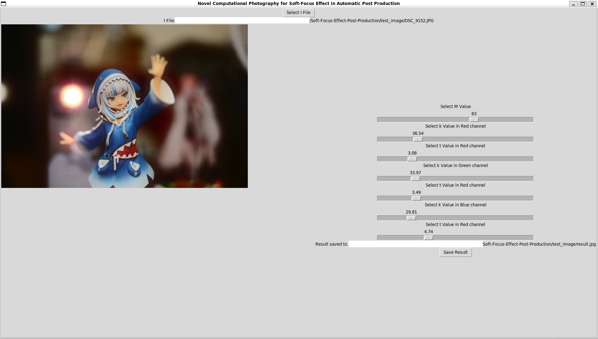

# Novel Computational Photography for Soft-Focus Effect in Automatic Post Production

## Introduction
This is a Python implementation of Algorithm 4 in my proposed paper, ``Novel Computational Photography for Soft-Focus Effect in Automatic Post Production``, with the pre-generated kernel estimate matrix. Additionally, the low-resolution preview feature is included.
The program is with a GUI and multi-thread programming for easy execution.

The code is tested under `Python 3.7.17` and ``Ubuntu 20.04`` and only currently supports three-channel images. Authentic B&W (only one channel) and four-channel images are not supported.


## Install
To use the program please install the required package firt.

### To install PIL
``sudo apt-get install python-imaging-tk``

### To install tkinter
``sudo apt-get install python3-tk ``

### To install resting package 
``pip install -r requirement.txt``

## Instruction
To run the program, run ``python3 main.py``, then you will see the GUI, and you can choose any RGB image you want. If there is any error right after you select the image, please ensure that the image you chose is a three-channel image, not a four-channel (some PNG images might contain a transparent channel) nor one-channel (B&W image).

## Demo
Click Select File to choose the desired image to generate a soft-focus effect.

Change the value of `M` to tune the major strength of the effect by dragging the bar. $(M \times 10000)^{0.9}=\chi$, where $\chi$ is defined in Eq. (32) in the paper.

Then, dragging the bar, choose each channel's desired $(k,t)$ value. The higher $t$ can get a smoother effect. The higher $k$ can have a more substantial impact.

After the adjustment, click `Save Result` to store the full-resolution result.

<center>
    
</center>


## Citation

If you would like to cite this work, please use the following bib.
```
@ARTICLE{10975140,
  author={Tsai, Hao-Yu and Tsai, Morris C.-H. and Huang, Scott C.-H. and Wu, Hsiao-Chun},
  journal={IEEE Transactions on Image Processing}, 
  title={Novel Computational Photography for Soft-Focus Effect in Automatic Post Production}, 
  year={2025},
  volume={34},
  number={},
  pages={2560-2574},
  keywords={Optical filters;Kernel;Lenses;Estimation;Cameras;Photography;Optical imaging;Convolution;Image restoration;Memory management;Kernel-matrix estimation;soft-focus effect;Kullback-Leibler divergence of discrete cosine transform (DCT-KLD);peak-signal-to-noise ratio (PSNR);irradiance;computational photography},
  doi={10.1109/TIP.2025.3562071}}
```
Moreover, if you have any questions about this project, please email to `s106021226@m106.nthu.edu.tw`.

## License
This code is released under the MIT License. 
